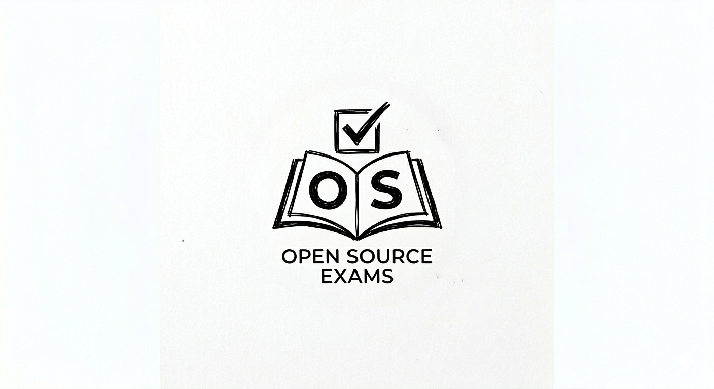

<p align="center">
  
</p>

<br/>

# Open Exam Practice

A public, local-first practice platform for any exam. No authentication,
accounts, or backend required — all progress is stored in the browser.

> **Live site:** [openexams.vercel.app](https://openexams.vercel.app)
> **Source:** [github.com/examtools/openexams](https://github.com/examtools/openexams)

---

## Tech Stack

| Layer        | Technology                                               |
|-------------|----------------------------------------------------------|
| Framework   | Next.js 16 (App Router)                                  |
| Language    | TypeScript                                                |
| Styling     | Tailwind CSS                                              |
| Fonts       | Fraunces (display) + Inter (body)                         |
| Persistence | localStorage (versioned)                                  |
| Testing     | Vitest (unit) + Playwright (E2E)                           |
| Deployment  | Vercel                                                    |

---

## Getting Started

```bash
npm install
npm run dev
```

Opens at [http://localhost:3000](http://localhost:3000).

### Available Scripts

| Command             | Description                                         |
|---------------------|-----------------------------------------------------|
| `npm run dev`       | Start local dev server (runs normalization first)   |
| `npm run build`     | Build for production (runs normalization first)      |
| `npm run start`     | Run production server                                |
| `npm run lint`      | Run Next.js lint                                     |
| `npm run test`      | Run Vitest unit tests                                |
| `npm run test:e2e`  | Run Playwright E2E tests                             |

---

## Project Structure

```
├── app/                      # Next.js App Router pages
│   ├── (marketing)/          # Landing page
│   ├── subjects/             # Subject listing + detail
│   ├── exam/[examId]/        # Exam engine
│   ├── history/              # Attempt history
│   └── layout.tsx            # Root layout (header, analytics)
├── components/
│   ├── branding/             # SiteLogo
│   ├── catalog/              # Subject list, exam cards
│   ├── exam/                 # Exam engine (client, review, timer, etc.)
│   ├── history/              # History page
│   ├── landing/              # Landing page (hero, feature sections, footer)
│   ├── seo/                  # JSON-LD structured data
│   └── ui/                   # ThemeToggle, PageHeader
├── lib/
│   ├── data/                 # Path constants, generated data readers
│   ├── exam/                 # Types, scoring, ID generation
│   ├── storage/              # localStorage persistence
│   └── utils/                # Slug helpers
├── Questions/                # Add any subject here
│   ├── Subject A/             # e.g., Biology, Mathematics, Physics
│   │   ├── 2020.js            # { year, questions: [...] }
│   │   ├── 2021.js
│   │   └── ...
│   ├── Subject B/             # Any subject — no limit
│   │   ├── 2020.js
│   │   ├── 2021.js
│   │   └── ...
│   └── ...                     # Drop in a folder + .js files, done
├── generated/                # AUTO-GENERATED (do not edit manually)
│   ├── manifest.json
│   ├── exams/*.json
│   └── reports/data-quality.json
├── images/questions/         # Source images for questions
├── public/images/questions/  # Copied image assets (auto-generated)
├── scripts/
│   ├── normalize-questions.ts
│   └── validate-generated-data.ts
├── tests/
│   ├── unit/
│   └── e2e/
└── QUESTIONS-FORMAT.md       # Full question format spec for AI agents
```

---

## Routes

| Route                               | Page              |
|-------------------------------------|-------------------|
| `/`                                 | Landing           |
| `/subjects`                         | Subject list      |
| `/subjects/[subjectSlug]`           | Year + variant    |
| `/exam/[examId]`                    | Exam engine       |
| `/history`                          | Attempt history   |

---

## Data Pipeline

### Overview

```
Questions/<Department>/<year>.js  ──┐
                                    ├──► [normalize-questions.ts] ──► generated/exams/<id>.json
Questions/<Department>/<year>-model.js ──┘                                    │
                                                                              ▼
                                                                     generated/manifest.json
```

The pipeline runs automatically before every `dev` and `build` via the `predev`
and `prebuild` scripts.

### Step-by-step

1. **Read** every `.js` file under `Questions/`
2. **Evaluate** each file safely using `vm.runInNewContext()`
3. **Normalize** each question into structured blocks (text, images, containers)
4. **Resolve images** — copy from `images/questions/` into `public/images/questions/`
5. **Validate** — flag questions missing text, options, or correct answers
6. **Write** JSON datasets to `generated/exams/<examId>.json`
7. **Build manifest** — aggregate metadata into `generated/manifest.json`
8. **Generate quality report** at `generated/reports/data-quality.json`
9. **Validate** — confirm every manifest entry has a corresponding dataset file

### For AI-assisted question generation

See **[QUESTIONS-FORMAT.md](./QUESTIONS-FORMAT.md)** — this file is designed to be
fed as context to an AI agent so it can generate new questions in the correct format.
Pass it along with any source material (past exams, textbooks, notes) and the agent
will produce ready-to-import question files.

---

## Question File Format (Quick Summary)

Each file under `Questions/` is a plain `.js` file containing an array:

```js
[
  {
    id: "2015_math_1",
    question: "If f(x) = 2x² - 3x + 1, find f(2).",
    options: ["3", "5", "7", "9"],
    correctAnswer: 0,
    explanation: "f(2) = 2(4) - 6 + 1 = 8 - 6 + 1 = 3."
  }
]
```

| Field           | Type            | Required | Notes                              |
|-----------------|-----------------|----------|------------------------------------|
| `id`            | `string`        | Yes      | Unique within file                 |
| `question`      | `string` / JSX  | Yes      | Supports ``, `<br>`, JSX      |
| `options`       | `string[]` / JSX[] | Yes   | Minimum 2                          |
| `correctAnswer` | `number`        | Yes      | 0-based index into `options`       |
| `explanation`   | `string` / null | No       | Shown after answering              |

See **[QUESTIONS-FORMAT.md](./QUESTIONS-FORMAT.md)** for the complete spec
including JSX support, image handling, model exams, and multi-line questions.

---

## Adding New Content

### New questions for an existing subject

1. Edit or create `Questions/<Subject>/<year>.js`
2. Run `npm run dev` — the pipeline processes it automatically
3. Verify at `http://localhost:3000/subjects/<slug>`

### New subject

1. Create `Questions/<New Subject>/<year>.js`
2. Run `npm run dev`
3. The subject appears automatically on the `/subjects` page

### New model exam variant

Name the file `<year>-model.js` (e.g. `2020-model.js`). The UI shows it as a
separate "Model" variant.

---

## Image Requirements

- Place source images in `images/questions/`
- Reference them in question text as ``
- Supported formats: PNG, JPG, JPEG, WEBP, GIF, SVG
- During normalization, images are copied to `public/images/questions/`

---

## Local Storage

All user progress is stored in the browser under the key:
`practice-exit-exam:storage`

| Data              | Description                            |
|-------------------|----------------------------------------|
| Attempts          | Completed exam attempts with answers    |
| Active sessions   | In-progress exam sessions               |
| Answers           | Per-question selected answers           |
| Flagged questions | User-flagged questions for review       |

Storage is versioned with automatic migration on schema changes.
Clearing browser data for this site will erase all progress.

---

## Deployment

Deployed on Vercel. No environment variables are required.

```bash
vercel --prod
```

The build step automatically runs normalization and validation.

---

## Architecture Notes

- **No authentication** — the app is fully public and local-first
- **Exams are static** — all data is generated at build time; no API needed for exam content
- **API routes** exist only for exam metadata (`/api/manifest`) and individual exam data (`/api/exams/[examId]`), enabling future client-side data fetching without large initial bundles
- **The exam engine** supports two modes:
  - **Practice** — untimed, shows correct answer immediately, skip freely
  - **Test** — timed, reveals results only after submission
- **Responsive** — desktop, tablet, and mobile layouts
- **Dark mode** — theme toggle with system preference detection
